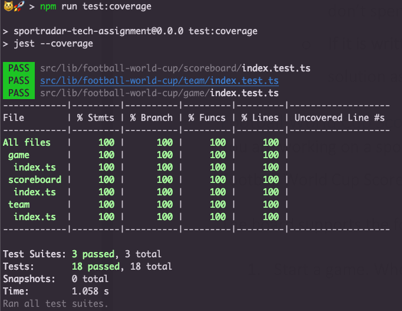

# sportradar-tech-assignment
Technical assignment for a Sr Frontend Engineer position at [Sportradar](https://sportradar.com)


## Scoreboard Library
This is a very simple Typescript library that consists of three classes: **Scoreboard**, **Game**, and **Team**. The *Scoreboard* class manages a list of games, each represented by a *Game* object. Each game has two teams, represented by *Team* objects. The library provides functionality for starting and finishing games, updating game scores, and getting a summary of games by total score.

## React App
A very lightweight react app that uses the Scoreboard library. It can be used as a Playground.

## Install
Run
```sh
npm i // or yarn
```

## Development
Run
```sh
npm run dev // or yarn dev
```
to spin up the development server.
Then, go to [](http://localhost:5173/) to see the demo app running.

You will see a screen similar to:


## Test

Unit tests are ara available when running the following command:
```sh
npm t // or npm test or yarn test
```
### Coverage
It is also possible to generate a local report with coverage information. It also shows the report on CLI when running the following command:

```sh
npm run test:coverage // or yarn test:coverage
```



## ⚠️⚠️⚠️ Decisions and assumptions

- I decided **to write a very simple React App** that shows how to interact with `Scoreboard` library.
- I did not **write tests for UI components** since the React app was **a little bit out of scope** for this assignment. However, I installed `React testing/library` to show that I would use it in case I would have tested UI React components.
- I did not follow a TDD approach when commiting new changes for the React app because of the same reason, since it was out of scope, I focused on keeping the quality on the library `Scoreboard`.

## Library Interface

### Creating a Scoreboard
To create a new Scoreboard, simply create a new instance of the Scoreboard class:

```typescript
import Scoreboard from '../lib/football-world-cup';

const scoreboard = new Scoreboard();
```

### Starting a Game
To start a new game, call the startGame method on the Scoreboard instance, passing in the names of the home and away teams:

```typescript
scoreboard.startGame('Home Team', 'Away Team');
```

### Updating a Game Score
To update the score of a game, call the updateGame method on the Scoreboard instance, passing in the names of the home and away teams and the new scores:

```typescript
scoreboard.updateGame('Home Team Name', 'Away Team Name', 2, 1);
```


### Finishing a Game
To finish a game, call the finishGame method on the Scoreboard instance, passing in the game instance:

```typescript
scoreboard.finishGame('Home Team Name', 'Away Team Name');
```

### Getting a Summary of Games
To get a summary of games by total score, call the getGamesByTotalScore method on the Scoreboard instance:

```typescript
const gamesSummary = scoreboard.getGamesByTotalScore();
console.log(gamesSummary);
```
The getGamesByTotalScore method returns an array of Game instances, sorted by total score (in descending order) and then by the time they were added to the scoreboard (in descending order).
